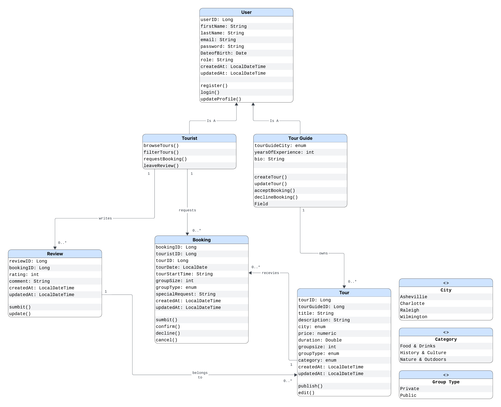

# Carolina Explorer - Backend API Documentation

**Version:** 1.0
**Last Updated:** March 4, 2026
**Base URL:** `http://localhost:8080/api`

---

## Table of Contents

1. [Overview](#1-overview)
2. [User Roles](#2-user-roles)
3. [UML Class Diagram](#3-uml-class-diagram)
4. [API Endpoints](#4-api-endpoints)
    - [Tourist Management](#tourist-management)
    - [Tour Guide Management](#tour-guide-management)
    - [Tour Management](#tour-management)
    - [Booking Management](#booking-management)
    - [Review Management](#review-management)
    - [Use Case Mapping](#use-case-mapping)

---
## 1. Overview
The Carolina Explorer Backend API provides a RESTful interface for managing:

- **User Accounts**: Tourists and Tour Guides
- **Tours**: Experiences created and managed by tour guides
- **Bookings**: Reservations made by tourists for specific tours
- **Reviews**: Feedback provided by tourists after completing a booking
- **Search & Filtering**: Browse tours by city, category, and price
- **Audit Logs (Future)**: Administrative tracking of system actions

---
## 2. User Roles

The API supports the following user roles:

| Role | Description | Primary Responsibilities |
|------|-------------|-------------------------|
| **TOURIST** | User who explores and books tours | Browse tours, make bookings, leave reviews |
| **TOUR_GUIDE** | User who creates and manages tours | Create and manage tours, view bookings |
| **SYS_ADMIN** *(Future)* | Platform administrator | Manage users, moderate content, view system activity |

---
## 3. UML Class Diagram


## 4. API Endpoints
**Note:** Users are created through role-specific endpoints (`/tourists`, `/tour-guides`), not through a generic `/users` endpoint. This ensures proper role assignment and role-specific attributes.

### Tourist/ Customer Management
#### Create Tourist
**Endpoint:** `POST /tourists`
**Use Case:** US-CUST-001 (Register as Tourist)
**Description:** Create a new tourist account with profile information.

```http
POST /tourists
Content-Type: application/json

{
  "firstName": "John",
  "lastName": "Doe",
  "email": "tourist@example.com",
  "passwordHash": "123",
  "role": "TOURIST"
}
```

**Response:**
```json
{
  "userId": 1,
  "firstName": "John",
  "lastName": "Doe",
  "email": "tourist@example.com",
  "role": "TOURIST",
  "createdAt": "2026-01-15T10:30:00",
  "updatedAt": "2026-01-15T10:30:00"
}
```

**Status Code:** `201 Created`

---

#### Get All Tourists
**Endpoint:** `GET /tourists`
**Use Case:** Admin user management
**Description:** Retrieve all tourists accounts.

```http
GET /tourists
```

**Status Code:** `200 OK`

---

#### Get Tourists by ID
**Endpoint:** `GET /tourists/{id}`
**Use Case:** Customer profile view
**Description:** Retrieve specific tourist by ID.

```http
GET /tourists/1
```

**Status Code:** `200 OK` or `404 Not Found`

---

#### Update Tourists
**Endpoint:** `PUT /tourists/{id}`
**Use Case:** US-CUST-001 (Update Profile)
**Description:** Update tourist profile information.

```http
PUT /tourists/1
Content-Type: application/json

{
  "firstName": "John",
  "lastName": "Smith"
}
```

**Response:** Updated Tourists object

**Status Code:** `200 OK` or `404 Not Found`

---

#### Delete Tourists
**Endpoint:** `DELETE /tourists/{id}`
**Use Case:** Account deletion
**Description:** Delete a tourist account.

```http
DELETE /tourists/1
```

**Status Code:** `204 No Content` or `404 Not Found`

---
### Tour Guides/Provider Management

#### Create Tour Guides
**Endpoint:** `POST /tour-guides`
**Use Case:** US-PROV-001 (Register as a tour guide)
**Description:** Create a new tour guide account.

```http
POST /tour-guides
Content-Type: application/json

{
  "firstName": "John",
  "lastName": "Smith",
  "email": "guide@example.com",
  "passwordHash": "123",
  "role": "TOUR_GUIDE",
  "bio": "Experienced local guide",
  "yearsOfExperience": 5
}
```

**Response:**
```json
{
  "userId": 2,
  "firstName": "John",
  "lastName": "Smith",
  "email": "guide@example.com",
  "role": "TOUR_GUIDE",
  "bio": "Experienced local guide",
  "yearsOfExperience": 5,
  "createdAt": "2026-01-15T10:30:00",
  "updatedAt": "2026-01-15T10:30:00"
}
```

**Status Code:** `201 Created`

---

#### Get All Tour Guides
**Endpoint:** `GET /tour-guides`
**Use Case:** Browse Tour Guides
**Description:** Retrieve all tour guide accounts.

```http
GET /tour-guides
```

**Status Code:** `200 OK`

---

#### Get Tour Guide by ID
**Endpoint:** `GET /tour-guides/{id}`
**Use Case:** View Tour Guide Profile
**Description:** Retrieve specific tour guide by ID.

```http
GET /tour-guides/2
```

**Status Code:** `200 OK` or `404 Not Found`

---

#### Update Tour Guides
**Endpoint:** `PUT /tour-guides/{id}`
**Use Case:** US-PROV-001 (Update Profile)
**Description:** Update tour guide profile information.

```http
PUT /tour-guides/2
Content-Type: application/json

{
  "bio": "Updated bio",
  "yearsOfExperience": 6
}
```

**Response:** Updated Tour Guides object

**Status Code:** `200 OK` or `404 Not Found`

---

#### Delete Tour Guides
**Endpoint:** `DELETE /tour-guides/{id}`
**Use Case:** Delete Account
**Description:** Delete a tour guide account.

```http
DELETE /tour-guides/2
```

**Status Code:** `204 No Content` or `404 Not Found`

---

### Tour Management

#### Create Tour
**Endpoint:** `POST /tours`
**Use Case:** US-PROV-002 (Create Tour)
**Description:** Tour guide creates a new tour.

```http
POST /tours
Content-Type: application/json

{
  "title": "Asheville Food Tour",
  "description": "Explore top restaurants",
  "city": "ASHEVILLE",
  "price": 80,
  "duration": 3,
  "category": "FOOD",
  "groupType": "PUBLIC",
  "tourGuideId": 2
}
```

**Response:**
```json
{
  "tourId": 1,
  "title": "Asheville Food Tour",
  "description": "Explore top restaurants",
  "city": "ASHEVILLE",
  "price": 80,
  "duration": 3,
  "category": "FOOD",
  "groupType": "PUBLIC",
  "createdAt": "2026-01-15T10:30:00",
  "updatedAt": "2026-01-15T10:30:00"
}
```

**Status Code:** `201 Created`

---

#### Get/Search Tours
**Endpoint:** `GET /tours`
**Use Case:** US-CUST-002 (Browse Tours), US-CUST-004 (Search/Filter Tours)
**Description:** Retrieve all tours or filter tours by specific criteria.

```http
GET /tours
```

**Filter Endpoints:**
- `/city/{city}` (Optional): Filter by city (ASHEVILLE, CHARLOTTE, RALEIGH, WILMINGTON)
- `/category/{category}` (Optional): Filter by category (FOOD, HISTORY, NATURE)
- `/price/{price}` (Optional): Filter by maximum price

**Example with filters:**
```http
GET /tours                     // all tours
GET /tours?city=ASHEVILLE     // filter by city
GET /tours?category=FOOD      // filter by category
GET /tours?price=100          // filter by price
GET /tours?city=ASHEVILLE&category=FOOD&price=100
```

**Status Code:** `200 OK`

---

#### Get Tour by ID
**Endpoint:** `GET /tours/{id}`
**Use Case:** US-CUST-003 (View Tour Details)
**Description:** Retrieve a specific tour.

```http
GET /tours/1
```

**Status Code:** `200 OK` or `404 Not Found`

---

#### Update Tour
**Endpoint:** `PUT /tours/{id}`
**Use Case:** US-PROV-003 (Update Tour)
**Description:** Update tour details.

```http
PUT /tours/1
Content-Type: application/json

{
  "title": "Updated Tour",
  "price": 90
}
```

**Response:** Updated tour object

**Status Code:** `200 OK`

---

#### Delete Tour
**Endpoint:** `DELETE /tours/{id}`
**Use Case:** US-PROV-004 (Delete a Tour)
**Description:** Delete a tour.

```http
DELETE /tours/{id}
```

**Status Code:** `204 No Content` or `404 Not Found`

---
### Booking Management

#### Create Booking
**Endpoint:** `POST /bookings`
**Use Case:** US-CUST-005 (Book a Tour)
**Description:** Create a booking for a selected tour.

```http
POST /bookings
Content-Type: application/json

{
  "touristId": 2,
  "tourId": 3,
  "groupSize": 4,
  "tourDate": "2026-04-01",
  "tourStartTime": "10:00 AM",
  "groupType": "PRIVATE",
  "specialRequest": "Window seat if possible"
}
```

**Response:**
```json
{
  "bookingId": 1,
  "tourDate": "2026-04-01",
  "groupSize": 4,
  "groupType": "PRIVATE",
  "specialRequest": "Window seat if possible",
  "createdAt": "2026-01-15T10:30:00",
  "updatedAt": "2026-01-15T10:30:00"
}
```

**Status Code:** `201 Created`

---

#### Get All Bookings
**Endpoint:** `GET /bookings`
**Use Case:** System overview
**Description:** Retrieve all bookings.

```http
GET /bookings
```

**Status Code:** `200 OK`

---

#### Get Bookings by Tourist
**Endpoint:** `GET /bookings/tourist/{id}`
**Use Case:** US-CUST-006 (View my bookings)
**Description:** Retrieve all bookings made by a tourist.

```http
GET /bookings/tourist/2
```
**Status Code:** `200 OK`

---

#### Get Bookings by Tour
**Endpoint:** `GET /bookings/tour/{id}`
**Use Case:** US-PROV-005 (View Tour bookings)
**Description:** Retrieve all bookings for a specific tour.

```http
GET /bookings/tour/3
```
**Status Code:** `200 OK`

---

**Booking Rules:**
- A tourist cannot book the same tour twice
- groupSize is required
- tourDate is required
- Booking must reference a valid tourist and tour
- groupSize must be greater than 0

---
### Review Management

#### Create Review
**Endpoint:** `POST /reviews`
**Use Case:** US-CUST-007 (Write a Review)
**Description:** Create a new review for a completed booking.

```http
POST /reviews
Content-Type: application/json

{
  "bookingId": 1,
  "rating": 5,
  "comment": "Amazing experience!"
}
```

**Response:**
```json
{
  "reviewId": 1,
  "booking": {
    "bookingId": 1
  },
  "rating": 5,
  "comment": "Amazing experience!",
  "createdAt": "2026-01-25T10:30:00"
}
```

**Validation Rules:**
- A review must be linked to a booking
- A tourist can only review their own booking
- Only one review per booking
- Rating must be between 1 and 5

**Status Code:** `201 Created`

---

#### Get All Reviews
**Endpoint:** `GET /reviews`
**Use Case:** US-CUST-008 (Read Reviews)
**Description:** Retrieve all reviews.

```http
GET /reviews
```

**Status Code:** `200 OK`

---

#### Get Review by Tour
**Endpoint:** `GET /reviews/tour/{tourId}`
**Use Case:** US-CUST-008 (Read Reviews for Tour)
**Description:** Retrieve all reviews for a specific tour.

```http
GET /reviews/tour/3
```

**Status Code:** `200 OK`

---

#### Get Reviews by Tourist
**Endpoint:** `GET /reviews/tourist/{touristId}`
**Use Case:** View personal reviews
**Description:** Retrieve all reviews written by a tourist.

```http
GET /reviews/tourist/2
```

**Response:** Array of reviews for the tour

**Status Code:** `200 OK`

---
## 5. Use Case Mapping

The API endpoints support the following use cases:

---

### Tourist (Customer) Use Cases

| Use Case | Description | Related Endpoints |
|----------|------------|------------------|
| **US-CUST-001** | Register & update tourist account | `POST /tourists`, `PUT /tourists/{id}` |
| **US-CUST-002** | Browse tours | `GET /tours` |
| **US-CUST-003** | View tour details | `GET /tours/{id}` |
| **US-CUST-004** | Search/filter tours | `GET /tours/city/{city}`, `GET /tours/category/{category}`, `GET /tours/price/{price}` |
| **US-CUST-005** | Book a tour | `POST /bookings` |
| **US-CUST-006** | View bookings | `GET /bookings/tourist/{id}` |
| **US-CUST-007** | Write a review | `POST /reviews` |
| **US-CUST-008** | Read reviews | `GET /reviews`, `GET /reviews/tour/{tourId}` |

---

### Tour Guide (Provider) Use Cases

| Use Case | Description | Related Endpoints |
|----------|------------|------------------|
| **US-PROV-001** | Register & update tour guide account | `POST /tour-guides`, `PUT /tour-guides/{id}` |
| **US-PROV-002** | Create tour | `POST /tours` |
| **US-PROV-003** | Update tour | `PUT /tours/{id}` |
| **US-PROV-004** | Delete tour | `DELETE /tours/{id}` |
| **US-PROV-005** | View bookings for tours | `GET /bookings/tour/{id}` |
---
